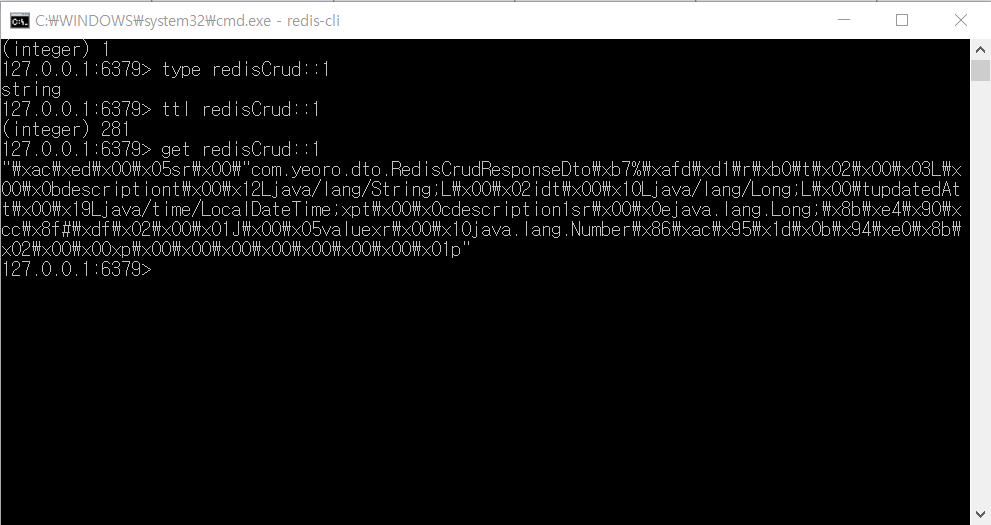

# Spring Boot + Redis (Lettuce, Cache) 
## Spring Boot와 Redis를 사용한 간단한 회원 관리 API 구현 예제
 

### **개발 환경**
- Java 11  
- STS4 4.9.0  
- Spring Boot 2.4.1  
- Redis 3.2.100   
- Swagger 3.0.0
 

### **API**
- Spec
|API Endpoint|HTTP Method|Request Body|Description|
|--|--|--|--|
|/redis-api/save|POST|{ "id": id,  "description": desc }|사용자 등록|
|/redis-api/get/{id}|GET||사용자 조회|
|/redis-api/users|GET|전체 사용자 조회|
|/redis-api/delete/{id}|DELETE|사용자 삭제|
 

- Url  
localhost:8080/swagger-ui/index.html

### **Caching Result**

- 캐시이름 : "고정된키값::유동적인값" 형태
- type : String 형식으로 구성된 캐시
- ttl(Time to Live) : 해당 키의 남은 유효시간
- get으로 조회시 데이터가 plain text가 아닌 직렬화(serialize)된 값임을 확인할 수 있음  
 

### **참고**
>- https://ozofweird.tistory.com/entry/Spring-Boot-Redis-Lettuce%EB%A5%BC-%EC%9D%B4%EC%9A%A9%ED%95%9C-%EA%B0%84%EB%8B%A8%ED%95%9C-API-%EC%A0%9C%EC%9E%91
>- https://daddyprogrammer.org/post/3870/spring-rest-api-redis-caching/
